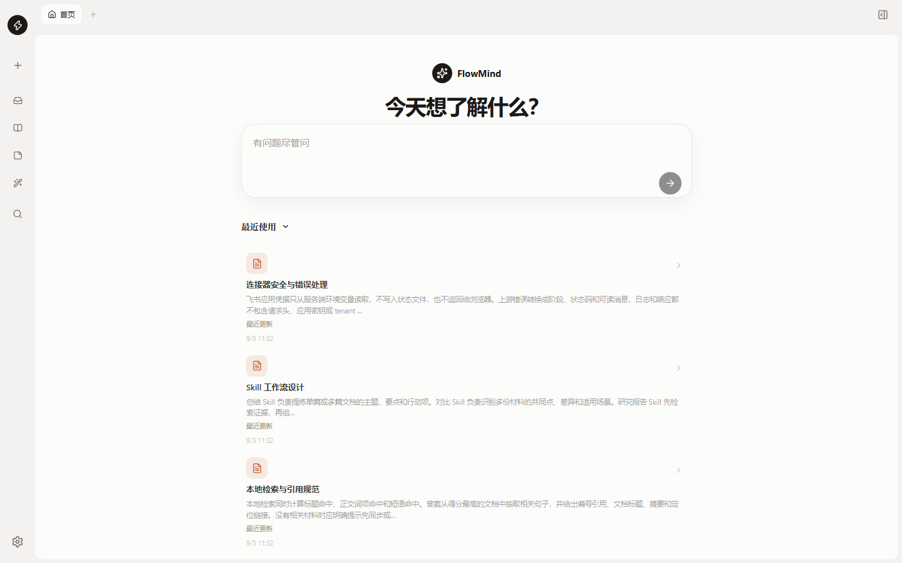
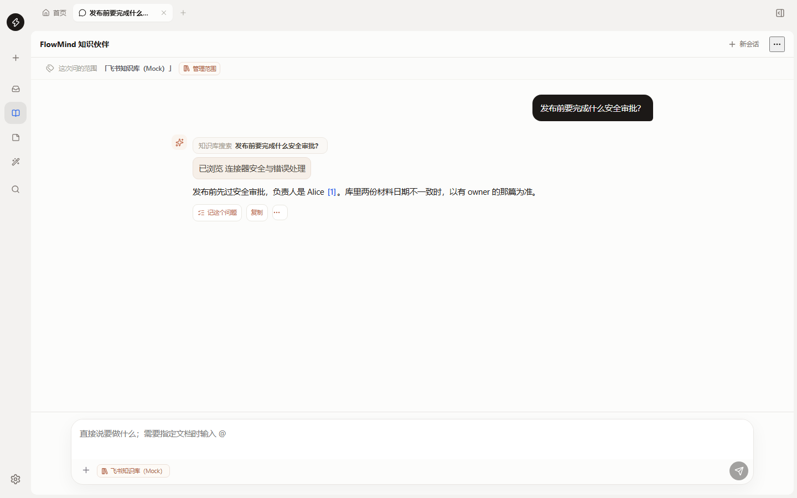
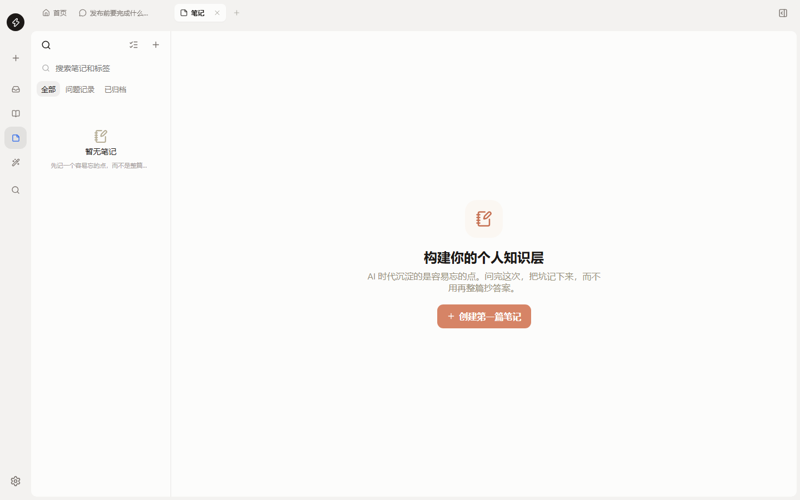
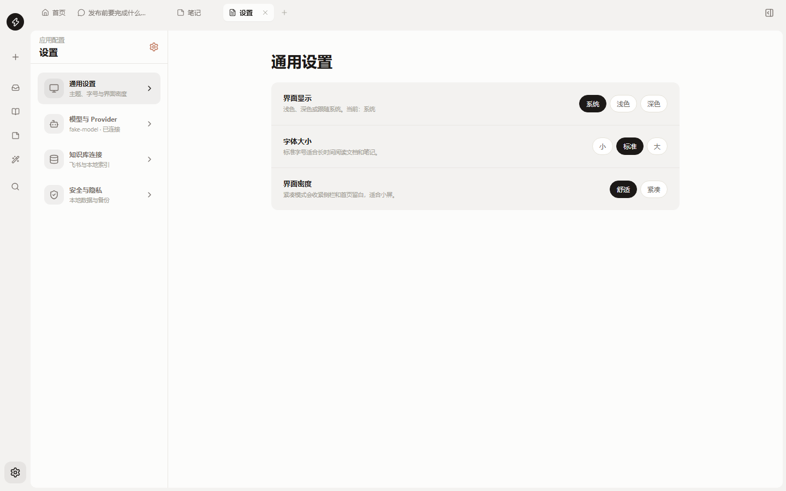

# FlowMind 飞书 AI 工作台

本地优先的知识工作台：同步飞书与本地文件，在当前工作面里问、读、记例外。答案必须有出处；库里没有的，直接说没有，不编。

[](https://github.com/lyqi712/flowmind-feishu/releases)
[](LICENSE)

<p align="center">
  
</p>

<p align="center"><b>下载 Windows 安装包</b> → <a href="https://github.com/lyqi712/flowmind-feishu/releases/latest">Releases</a></p>

---

## 它长什么样

| 问答带引用 | 问题记录，只记容易忘的点 |
| --- | --- |
|  |  |

<p align="center">
  
</p>

## 你能用它做什么

- **飞书知识进本地库**：粘贴 Docx / Wiki / Sheet / Bitable / Folder 链接，自动发现空间，SQLite/FTS 做唯一正文来源。
- **问库里的事实**：流式回答、可点击引用、空检索拒答。寒暄和「下次记得…」不等模型。
- **问题记录**：独立笔记类型，记坑不记百科。网页剪藏带 `sourceRefs`。
- **MCP**：Claude Desktop / Codex 可把 FlowMind 当知识工具；设置里也可接入其他 MCP 服务（只列出和读取，不擅自写入）。

## 安装

1. 打开 [Releases](https://github.com/lyqi712/flowmind-feishu/releases/latest)
2. 下载 `FlowMind 飞书 AI 工作台-1.3.0-x64.exe`
3. 安装后从开始菜单或桌面打开

源码可编译，完整安装包只放在 Release，避免把 180MB+ 安装器塞进 Git。

密钥和知识库只存在你这台电脑上，不会随仓库发布。

## 从源码运行

```powershell
cd app
npm.cmd install
npm.cmd run dev
```

```powershell
npm.cmd run check          # 单测 + 生产构建
npm.cmd run mcp:smoke      # MCP stdio 协议
npm.cmd run desktop:pack   # Windows NSIS 安装包
```

## 接到 Claude / Codex

仓库里有现成模板：

- [`app/mcp/claude-desktop.example.json`](app/mcp/claude-desktop.example.json)
- [`app/mcp/codex.example.toml`](app/mcp/codex.example.toml)

工具：`search_knowledge`、`ask_knowledge`（无证据则拒答）、`run_skill`、`feishu_sync` 等。

## 原则

1. 没有命中证据就不编事实。
2. 飞书 Secret 和模型 Key 只在服务端加密保存。
3. 不重置用户数据。
4. 不做成广场、博客、生图或 PPT 产品。

## 许可

MIT。见 [LICENSE](LICENSE)。
