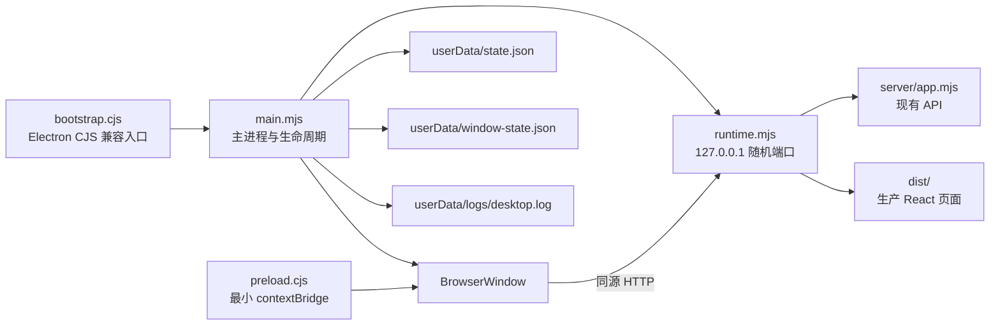

# FlowMind Windows 桌面壳与打包方案

日期：2026-08-03  
状态：桌面壳源码与 smoke 已实现；根 `app/package.json` 按任务约束未修改，因此正式安装包要在应用项目登记 Electron 依赖后生成。

## 1. 交付范围

本次新增文件严格位于指定范围：

```text
app/desktop/bootstrap.cjs
app/desktop/main.mjs
app/desktop/preload.cjs
app/desktop/runtime.mjs
app/desktop/logger.mjs
app/desktop/window-state.mjs
app/desktop/package.json
app/desktop/electron-builder.yml
scripts/desktop/start-desktop.ps1
scripts/desktop/build-desktop.ps1
scripts/desktop/smoke-desktop.ps1
scripts/desktop/smoke-host.mjs
scripts/desktop/smoke-electron.mjs
research/desktop-packaging.md
```

没有把 App ID、App Secret、API Key、模型 Token 或其他凭据写入上述文件。

## 2. 运行架构



桌面主进程不打开固定 API 端口。它在 `127.0.0.1:0` 上监听，由系统选择空闲端口，然后让 BrowserWindow 加载该同源地址。这样同时解决：

- 多实例或开发服务造成的端口冲突；
- `file://` 页面无法正常使用现有相对 `/api/*` 请求；
- 生产 UI 与 API 的跨域配置复杂度；
- 外部网络直接访问本地 API 的风险。

`runtime.mjs` 显式向现有 `createApp` 传入 `staticDir: null`，避免后端自身 SPA fallback 抢占桌面健康检查和静态路由；桌面层统一负责生产 `dist` 与 API 的路由顺序。

## 3. Electron 主进程能力

### 生命周期

- 单实例锁：第二次启动时聚焦并恢复现有窗口。
- 启动本地 API 和生产静态站点。
- 恢复窗口大小、坐标和最大化状态。
- 最小窗口尺寸为 `960 × 640`。
- 窗口位置落在已拔除显示器时，自动回到当前可见显示区域。
- Windows/Linux 关闭最后窗口时退出；macOS 风格 activate 时可重建窗口。
- `before-quit` 阶段依次保存窗口状态、关闭 HTTP server、刷新日志并退出。
- 捕获主进程未处理异常和 Promise rejection，并写入脱敏日志。

### 本地数据

开发壳包名为 `flowmind-desktop-shell`；打包后产品名由根应用元数据与 builder 配置决定。运行数据使用 Electron `app.getPath('userData')`，不写入安装目录：

```text
<userData>/state.json
<userData>/window-state.json
<userData>/logs/desktop.log
<userData>/logs/desktop.log.1
```

日志文件达到 5 MiB 后轮转一份。日志输出会遮盖常见的 `Authorization: Bearer`、API Key、App Secret、Access Token、Tenant Token 和 Password 字段。

## 4. Renderer 安全边界

BrowserWindow 使用：

```text
contextIsolation: true
nodeIntegration: false
nodeIntegrationInWorker: false
nodeIntegrationInSubFrames: false
sandbox: true
webSecurity: true
webviewTag: false
navigateOnDragDrop: false
devTools: 仅未打包且非 smoke 模式启用
```

其他控制：

- 所有 Chromium 权限请求默认拒绝。
- 新窗口永远不在 App 内创建。
- 非本地 origin 的导航会被阻止。
- 仅 `https:`、`http:` 和 `mailto:` 可交给系统默认程序打开。
- 本地页面注入严格 CSP；脚本、连接和 frame 均限制为本地同源。
- preload 只暴露 `platform`、Electron/Chrome 版本、只读 App 信息和受协议白名单约束的 `openExternal`。
- Renderer 不获得 Node、文件系统、Shell 或任意 IPC 能力。

## 5. 精确 package.json 建议

任务要求本次不修改 `app/package.json`。正式纳入项目时建议对该文件做以下精确合并，而不是替换已有字段。

### 新增顶层 main

```json
{
  "main": "desktop/bootstrap.cjs"
}
```

### 合并 scripts

```json
{
  "scripts": {
    "desktop:start": "powershell.exe -NoProfile -ExecutionPolicy Bypass -File ../scripts/desktop/start-desktop.ps1",
    "desktop:smoke": "powershell.exe -NoProfile -ExecutionPolicy Bypass -File ../scripts/desktop/smoke-desktop.ps1 -RequireElectron",
    "desktop:pack": "powershell.exe -NoProfile -ExecutionPolicy Bypass -File ../scripts/desktop/build-desktop.ps1"
  }
}
```

### 合并 devDependencies

2026-08-03 验证时使用的版本：

```json
{
  "devDependencies": {
    "electron": "43.2.0",
    "electron-builder": "26.15.3"
  }
}
```

安装命令：

```powershell
cd D:\luxiaofei\ima-feishu\app
npm.cmd install --save-dev --save-exact electron@43.2.0 electron-builder@26.15.3
```

Electron 和 electron-builder 应保持在 `devDependencies`，不应打入应用的生产依赖树。现有 Express 及服务端运行依赖继续保留在 `dependencies`。

## 6. 开发与生产启动

### 安装依赖后启动桌面 App

```powershell
powershell.exe -NoProfile -ExecutionPolicy Bypass `
  -File D:\luxiaofei\ima-feishu\scripts\desktop\start-desktop.ps1
```

启动脚本默认先运行生产 Renderer 构建，再用本地 Electron 启动桌面壳。

已存在新鲜 `app/dist` 时跳过 Web 构建：

```powershell
powershell.exe -NoProfile -ExecutionPolicy Bypass `
  -File D:\luxiaofei\ima-feishu\scripts\desktop\start-desktop.ps1 `
  -SkipWebBuild
```

脚本不读取或写入密钥。飞书与模型配置仍由现有服务端配置层负责；桌面主进程只原样继承当前进程环境，不打印环境变量。

## 7. 打包

默认同时生成 x64 NSIS 安装包和 ZIP 便携包：

```powershell
powershell.exe -NoProfile -ExecutionPolicy Bypass `
  -File D:\luxiaofei\ima-feishu\scripts\desktop\build-desktop.ps1
```

只生成 NSIS：

```powershell
powershell.exe -NoProfile -ExecutionPolicy Bypass `
  -File D:\luxiaofei\ima-feishu\scripts\desktop\build-desktop.ps1 `
  -Target nsis `
  -Arch x64
```

只生成 ZIP：

```powershell
powershell.exe -NoProfile -ExecutionPolicy Bypass `
  -File D:\luxiaofei\ima-feishu\scripts\desktop\build-desktop.ps1 `
  -Target zip `
  -Arch x64
```

产物目录：

```text
D:\luxiaofei\ima-feishu\app\desktop\out
```

当前 builder 配置：

- App ID：`com.flowmind.feishucopilot`
- 可执行文件名：`FlowMind.exe`
- 安装范围：当前用户，默认不要求管理员权限
- 安装界面：可选择安装目录
- 快捷方式：桌面与开始菜单
- 数据卸载策略：默认保留 userData，避免误删用户知识库和会话
- 打包格式：ASAR
- 自动发布：关闭
- 强制签名：关闭

正式分发前建议补充：

1. Windows Authenticode 代码签名证书；
2. `app/desktop/assets` 下的多尺寸 `.ico`；
3. 明确的升级源和签名更新清单；
4. 安装包级自动更新回滚策略；
5. CI 中的 Windows x64 clean-room 打包。

## 8. Smoke 检查

安装 Electron 后运行：

```powershell
powershell.exe -NoProfile -ExecutionPolicy Bypass `
  -File D:\luxiaofei\ima-feishu\scripts\desktop\smoke-desktop.ps1 `
  -RequireElectron
```

检查内容：

1. 所有 JS/CJS/MJS 文件通过 `node --check`；
2. 本地桌面 Host 使用随机回环端口启动；
3. `/desktop-healthz` 返回正确 JSON；
4. `/api/state` 可访问并返回知识库状态；
5. `/` 返回生产 Renderer；
6. 未知 `/api/*` 返回 JSON 404，而不是 SPA HTML；
7. 日志脱敏规则工作；
8. 非法窗口尺寸被纠正；
9. 真实 Electron 创建 BrowserWindow、加载生产页面、调用健康接口并优雅退出。

不安装 Electron 时，只验证 Node/HTTP 层：

```powershell
powershell.exe -NoProfile -ExecutionPolicy Bypass `
  -File D:\luxiaofei\ima-feishu\scripts\desktop\smoke-desktop.ps1 `
  -SkipElectronLaunch
```

也可以给 smoke 脚本传入独立 Electron 路径：

```powershell
powershell.exe -NoProfile -ExecutionPolicy Bypass `
  -File D:\luxiaofei\ima-feishu\scripts\desktop\smoke-desktop.ps1 `
  -RequireElectron `
  -ElectronExe C:\path\to\electron.exe
```

## 9. 2026-08-03 验证记录

### Node/HTTP 与真实 Electron smoke

命令：

```powershell
powershell.exe -NoProfile -ExecutionPolicy Bypass `
  -File D:\luxiaofei\ima-feishu\scripts\desktop\smoke-desktop.ps1 `
  -RequireElectron `
  -ElectronExe C:\Users\Administrator\AppData\Local\npm-cache\_npx\705368f68fe8eb74\node_modules\electron\dist\electron.exe
```

关键输出：

```text
{"ok":true,"checks":["desktop-health","api-state","renderer-index","api-404","log-redaction","window-state"],"origin":"http://127.0.0.1:60926"}
{"ok":true,"origin":"http://127.0.0.1:56605","electronExitCode":0}
Desktop smoke checks passed.
```

实际使用 Electron `43.2.0`。Smoke 模式窗口保持隐藏，生产 `dist` 被真实 BrowserWindow 加载；测试结果通过临时 JSON 文件返回，完成后自动删除。

### 未执行的门槛

正式 NSIS/ZIP 产物本次没有生成，因为任务明确禁止修改 `app/package.json`，且项目尚未登记本地 `electron` / `electron-builder` 开发依赖。完成第 5 节的 package.json 合并并执行 `npm.cmd install` 后，可直接运行第 7 节打包脚本。

## 10. 回滚

本次交付是独立文件，无需修改现有前后端即可移除。回滚时删除：

```text
D:\luxiaofei\ima-feishu\app\desktop
D:\luxiaofei\ima-feishu\scripts\desktop
D:\luxiaofei\ima-feishu\research\desktop-packaging.md
```

如果已经安装桌面包，先通过 Windows“已安装的应用”卸载。默认不会删除 `%APPDATA%` 下的知识库状态；确认不再需要数据后再由用户显式清理对应 userData 目录。
